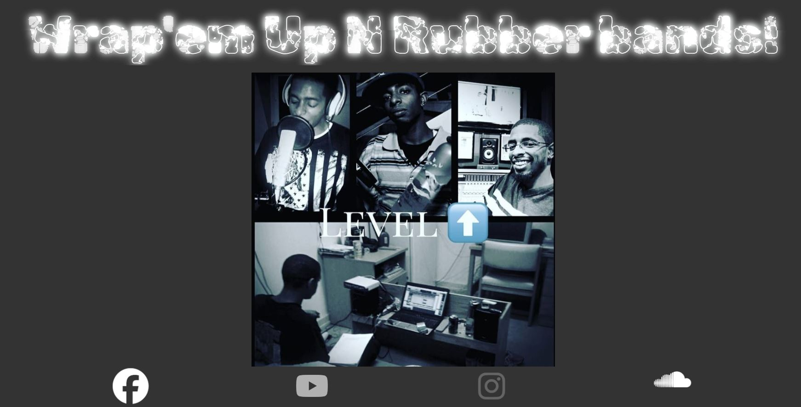

# Chris the Producer

## Table of contents

- [Overview](#overview)
  - [The challenge](#the-challenge)
  - [Screenshot](#screenshot)
  - [Links](#links)
- [My process](#my-process)
  - [Built with](#built-with)
  - [What I learned](#what-i-learned)
  - [Continued development](#continued-development)
- [Author](#author)

## Overview

### The challenge

Users should be able to:

- View the optimal layout for the app depending on their device's screen size
- See Images of the person of interest
- Select multiple ways of contact

### Screenshot

### Links

- Live Site URL: [View](https://christheproducer.netlify.app/)

## My process

### Built with

- Semantic HTML5 markup
- [Bootstrap](https://getbootstrap.com/) - CSS library
- CSS custom properties
- [Sass](https://sass-lang.com/) - Preprocessor scripting language
- Flexbox
- Mobile-first workflow
- Mobile-Responsive Design
- JavaScript - Scripting language
- [React](https://reactjs.org/) - JS library

### What I learned

Nothing really learned here, mostly just to practice my skills.

### Continued development

This was my first project that I did on my own. Updated it as I learning more lessons and techniques.

## Author

- Website - [Cameron Howze](https://camkol.github.io/)
- Frontend Mentor - [@camkol](https://www.frontendmentor.io/profile/camkol)
- GitHub- [@camkol](https://github.com/camkol)
- LinkedIn - [@cameron-howze](https://www.linkedin.com/in/cameron-howze-28a646109/)
- E-Mail - [cameronhowze4@outlook.com](mailto:cameronhowze4@outlook.com)
